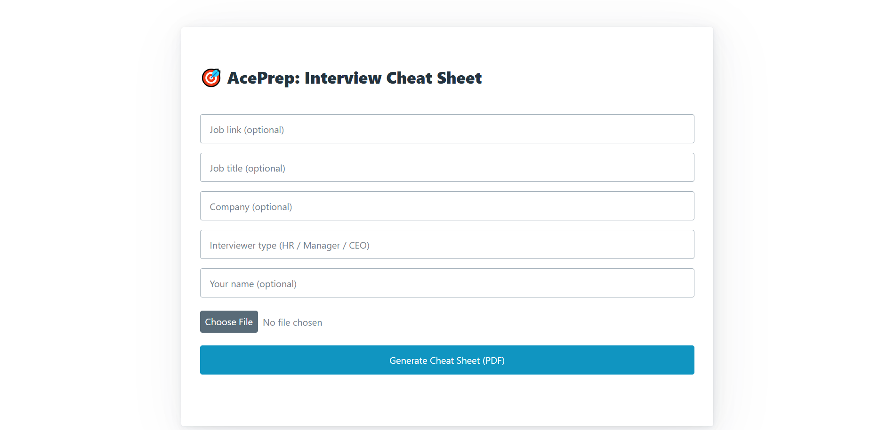
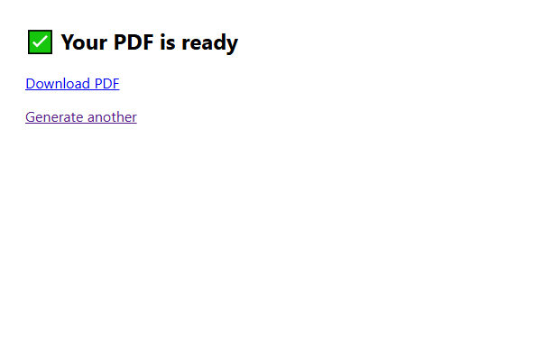
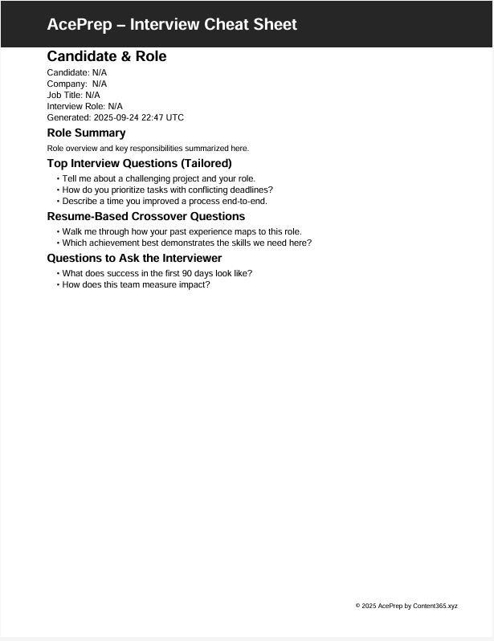

Here’s a polished, recruiter-ready **README.md** you can paste in full:

---

# AcePrep – Interview Cheat Sheet (FastAPI)

Tailored interview prep in seconds: upload your resume, paste a job link, and get a clean PDF with a **role summary**, **tailored interview questions**, **resume-based crossover questions**, and **smart questions to ask**.

<p align="center">
  
  
  
  
  
  
</p>

---

## ✨ Features

* **Resume upload** (PDF/DOCX) parsing
* **Job link parsing** to extract the description
* **LLM-tailored content** with a robust **fallback** (works with **no API keys**)
* **Branded PDF export** (ReportLab)
* **Optional email delivery** via SendGrid (can be disabled)
* **Stripe checkout hooks** (safe no-crash when unconfigured)
* **Dockerfile** + Railway friendly

---

## 🧪 Quickstart (Local)

> Works without any API keys — you’ll still get a great PDF via fallback.

**Windows PowerShell**

```powershell
# from repo root
python -m venv .venv
.\.venv\Scripts\Activate.ps1
pip install -r requirements.txt python-multipart
Copy-Item .env.example .env
uvicorn app.main:app --host 127.0.0.1 --port 8000 --reload
# open http://127.0.0.1:8000
```

**macOS/Linux**

```bash
python3 -m venv .venv
source .venv/bin/activate
pip install -r requirements.txt python-multipart
cp .env.example .env
uvicorn app.main:app --host 127.0.0.1 --port 8000 --reload
# open http://127.0.0.1:8000
```

---

## 🔐 Environment

Create a `.env` (or copy `.env.example`) with:

```env
IS_PREMIUM_MODE=false
OPENROUTER_API_KEY=
OPENROUTER_MODEL=meta-llama/llama-3.1-70b-instruct

# Email (optional; app runs fine without)
SENDGRID_API_KEY=
FROM_EMAIL=contact@content365.xyz
FROM_NAME=AcePrep

# Stripe (optional; safe when unset)
STRIPE_SECRET_KEY=
STRIPE_PRICE_ID=
```

* **No keys? No problem.** The app runs with a built-in fallback and still produces a polished PDF.
* Set `IS_PREMIUM_MODE=true` to enable the `/buy` flow (requires Stripe keys).
* If you don’t want email, simply leave `SENDGRID_API_KEY` empty or hide the email field on the form (already supported).

---

## 🖼️ Screenshots & Sample

<p align="center"></p>
<p align="center"></p>
<p align="center"></p>

- **Sample PDF:** [sample_output/aceprep-sample.pdf](sample_output/aceprep-sample.pdf)

---

## 🧠 Why this project matters (recruiter view)

* Shows **end-to-end product thinking**: UX form → parsing → LLM (or safe fallback) → branded PDF → optional email/paywall.
* Demonstrates **prompt design** + deterministic fallbacks for reliability.
* Includes **practical integrations** (doc parsing, bs4 scraping, email, Stripe) with graceful degradation.
* Production-lean code: clear structure, `.env` config, Docker, and minimal dependencies.

---

## 🏗️ Tech Stack

* **Backend:** FastAPI (Python 3.11), Uvicorn
* **Parsing:** `pdfplumber`, `python-docx`, `beautifulsoup4`
* **LLM:** OpenRouter API (optional) with a safe built-in fallback
* **PDF:** ReportLab
* **Email:** SendGrid (optional)
* **Payments:** Stripe Checkout (optional)
* **UI:** Jinja templates, Tailwind/PicoCDN

---

## 📁 Project Structure

```
.
├─ app/
│  ├─ main.py
│  ├─ templates/          # index.html, form.html, generate.html, success.html
│  └─ utils/              # generate_cheat_sheet.py, parser.py, pdf_generator.py, ...
├─ static/                # favicon, assets
├─ sample_output/         # aceprep-sample.pdf (tracked)
├─ docs/                  # README screenshots
├─ .env.example
├─ requirements.txt
├─ Dockerfile
└─ README.md
```

---

## 🚀 Deploy (Docker)

```bash
docker build -t aceprep .
docker run -p 8000:8000 --env-file .env aceprep
# open http://127.0.0.1:8000
```

---

## ✅ Troubleshooting

* **`python-multipart` error** when posting the form:
  `pip install python-multipart`
* **Port already in use**:
  `uvicorn app.main:app --port 8010 --reload`
* **Favicon 404**: ensure `static/favicon.svg` exists and templates include
  `<link rel="icon" href="/static/favicon.svg" type="image/svg+xml">`
* **Email disabled message**: expected if `SENDGRID_API_KEY` is blank.
* **LLM offline**: if no OpenRouter key, the app uses the built-in fallback and still generates a strong PDF.

---

## 🧪 (Optional) Minimal CI

Add `.github/workflows/ci.yml` to verify install & import:

```yaml
name: CI
on: [push, pull_request]
jobs:
  build:
    runs-on: ubuntu-latest
    steps:
      - uses: actions/checkout@v4
      - uses: actions/setup-python@v5
        with:
          python-version: "3.11"
      - run: pip install -r requirements.txt
      - run: python -c "import app.main; print('AcePrep import OK')"
```

---

## 📄 License

MIT © 2025 Nathan Bentley

---

## 📬 Contact

**Nathan Bentley** · [contact@content365.xyz](mailto:contact@content365.xyz) · GitHub: **@NateDiesel**

---

If you want me to also drop in the CI file and MIT `LICENSE` via a PR-ready patch, say the word and I’ll draft the exact files to add.
